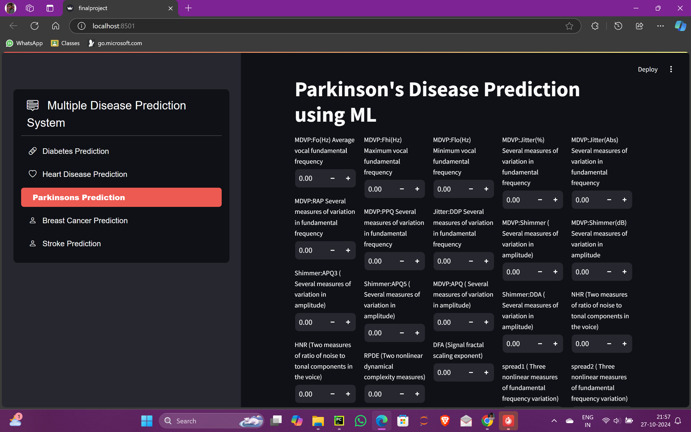

## Overview

This repository hosts a **Multiple Disease Prediction System** built with Streamlit and machine learning models. The application allows users to predict the likelihood of several diseases, including:

- **Diabetes**  
- **Heart Disease**  
- **Parkinson's Disease**  
- **Breast Cancer**  
- **Stroke**

Each prediction model is based on a trained machine learning algorithm, providing users with actionable results and preventive measures.

---

## Features

1. **User-friendly Interface**: Navigate through different prediction modules from the sidebar.  
2. **Disease-specific Inputs**: Input data required for each disease’s prediction.  
3. **Actionable Results**: Get results along with recommended precautions based on the prediction.  

---

## Installation

1. Clone the repository:
   ```bash
   git clone https://github.com/Kumar19Aditya/multiple-disease-prediction.git
   cd multiple-disease-prediction
   ```

2. Install the dependencies:
   ```bash
   pip install -r requirements.txt
   ```

3. Run the Streamlit app:
   ```bash
   streamlit run finalproject.py
   ```

---

## Application Structure

### Sidebar Navigation
- Choose between five prediction modules:
  - **Diabetes Prediction**  
  - **Heart Disease Prediction**  
  - **Parkinson's Prediction**  
  - **Breast Cancer Prediction**  
  - **Stroke Prediction**

---

## Models Used

- **Diabetes Model**: `final_diabetic_model_project.sav`
- **Heart Disease Model**: `final_heart_disease_model_project.sav`
- **Parkinson’s Model**: `final_parkinsons_model_project.sav`
- **Breast Cancer Model**: `final_breast_cancer_model_project.sav`
- **Stroke Model**: `final_stroke_model_project.sav`

Make sure the `.sav` files are placed in the specified directory path to ensure proper functionality.

---

## Example Input (Diabetes Prediction)

| Feature                  | Description                    |
|--------------------------|--------------------------------|
| Pregnancies              | Number of pregnancies          |
| Glucose Level            | Blood glucose level            |
| Blood Pressure           | Blood pressure value           |
| Skin Thickness           | Skinfold thickness value       |
| Insulin Level            | Insulin concentration          |
| BMI                      | Body Mass Index                |
| Diabetes Pedigree        | Diabetes Pedigree Function     |
| Age                      | Age of the person              |

---

## Precautions (Sample for Diabetes)

If the person is diabetic:
- **Diet**: Focus on balanced meals, limit sugary foods.  
- **Exercise**: Engage in regular physical activity.  
- **Monitoring**: Check blood sugar levels regularly.  
- **Lifestyle**: Avoid smoking, limit alcohol, manage stress.

---

## Screenshots
## Home Page for Diabetes


## Home page for Heart Disease


## Home page for Parkinsons


## Home page for Breast Cancer


## Home page for Stroke


## Prediction Page


## Requirements

- **Python 3.x**
- **Streamlit**  
- **pandas**  
- **joblib**  
- **pickle**

Install them using:
```bash
pip install streamlit pandas joblib
```

---

## Directory Structure

```
multiple-disease-prediction/
│
├── Datasets/
│   ├── Breast_cancer_data.csv
│   ├── diabetes(1).csv
│   ├── healthcare-dataset-stroke-data
│   ├── heart.csv
│   └── parkinsons.csv
├── models/
│   ├── final_diabetic_model_project.sav
│   ├── final_heart_disease_model_project.sav
│   ├── final_parkinsons_model_project.sav
│   ├── final_breast_cancer_model_project.sav
│   └── final_stroke_model_project.sav
├── Prediction Ipynb Files/
│   ├── Breast Cancer prediction.csv
│   ├── Diabetic Disease Prediction.ipynb
│   ├── Heart Disease Prediction.ipynb
│   ├── Parkinsons Disease Prediction.ipynb
│   └── stroke_prediction.ipynb
├── Application.py
├── requirements.txt
└── README.md
```

---

## License

This project is licensed under the MIT License - see the [LICENSE](LICENSE) file for details.

---

## Contribution

Contributions are welcome! Feel free to open issues or submit pull requests for improvements.

---

## Contact

For any inquiries or feedback, contact: **adityapupun535@gmail.com**

---

This README serves as a complete guide to set up, run, and understand the functionality of the **Multiple Disease Prediction System**. Happy predicting! 🎯
